Continuous Delivery for Docker Containers

## Pre-requisites

* Kubernetes setup with kops from Project-15
* Jenkins, Nexus and Sonar server setup from Project-5
* DockerHub user account
* GitHub account
* Slack account

_Friendly reminders:_

* I have completed these projects under my "20 Days 20 DevOps Projects" challenge.
* Projects named as Project-1 thru Project-20 as part of this challenge
* I have been using same Jenkins, Nexus and SonarQube servers from Project-5 and kops server from Project-14.
* This project cannot be completed without having same setup. 
* Make sure you configure jenkins credentials, global tool and system with same credential names used in Jenkinsfile.
* Make sure you have necessary tools installed as mentioned in previous projects.
* You may need to update Sonar webhook and Github webhook with new url.
* You may need new Token for integrations.
GOOD LUCK!

### Step-1: Jenkins, Sonar and Docker Integration

_Note: If you have been using the same Jenkins server from previous projects, Jenkins may run out of volume. In that case, go to AWS console, select Jenkins instance, click volume under Storage section. Acions --> Modify Volume. Increase volume form 8 to 16 GB._

Go to source code, we will use files under `cicd-kube` branch from below repository:
```sh
https://github.com/devopshydclub/vprofile-project.git
```
#### Jenkins-Sonar Integration

So far we should have 3 running servers(Jenkins, Sonar and kOps) with proper configuration setup from previous steps as mentioned in pre-requisites.

First we will create a new token in Sonar server.

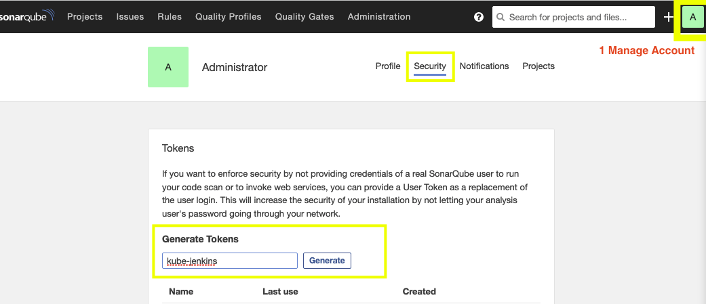

Go to Jenkins server, `Manage Jenkins` -> `Configure System` . Find section named as  `SonarQube Servers`.
```sh
Name: sonar-pro  # use the same name, it will be used in our Jenkinsfile
Server URL: http://<private_ip_of_sonar_server>
Server Authentication token: Add the new token as secret text
```

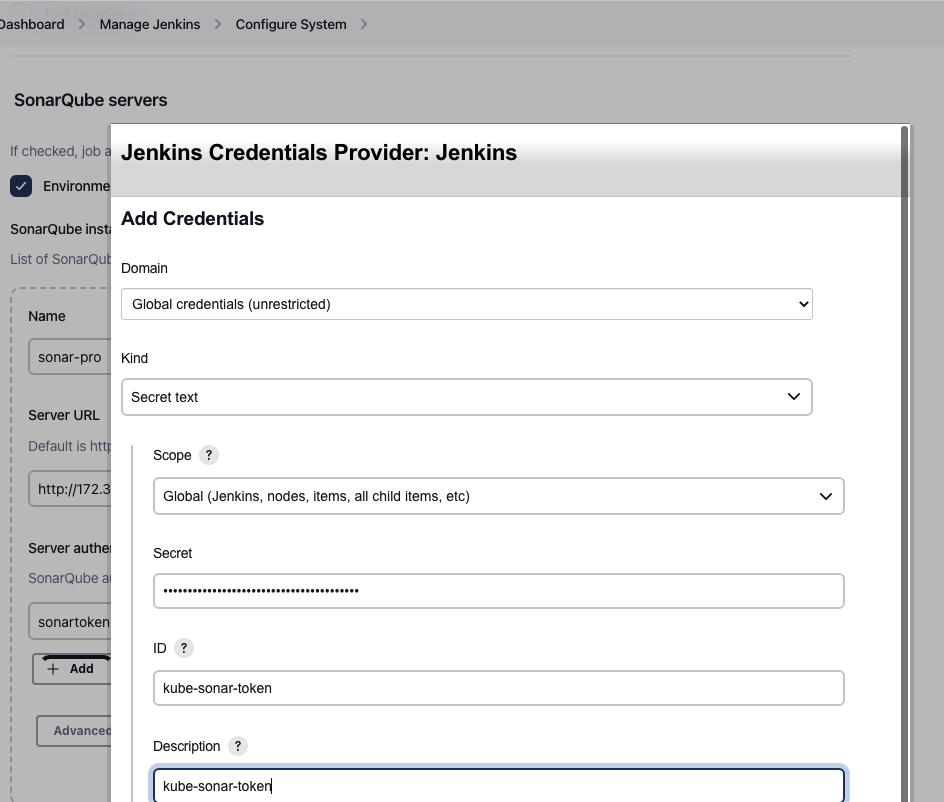

Add below security group Inbound rule to Jenkins-SG:
```sh
Allow all traffic from Sonar-SG
```

Add below security group Inbound rule to Jenkins-SG:
```sh
Allow all traffic from Jenkins-SG
```

#### Jenkins-DockerHub Integration

We need to add our DockerHub credentials to Jenkins.( _PS: If you don't have an DockerHub account, you can create a free account._)

Go to `Manage Jenkins` -> `Manage Credentials` -> `Add credentials`. As ID we will give `dockerhub` which is used in Jenkinsfile.

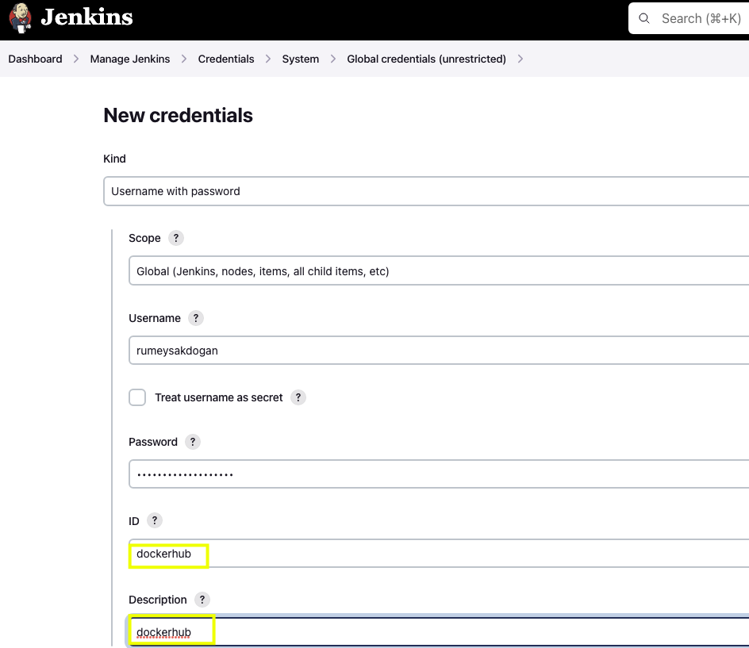

#### Install Docker engine in Jenkins server

Next we will SSH into Jenkins server to install docker engine. Our Jenkins server is running on Ubuntu machine. We will follow official [documentation steps](https://docs.docker.com/engine/install/ubuntu/) to install docker for Ubuntu.


After steps completed, we can check status od `docker` service.


The reason we are installing docker in Jenkins server, we will run docker commands during pipeline as jenkins user. Lets login as `jenkins` user and try to run any `docker` command.


The reason for this permission error is, currently only `root` user is able to run docker commands. Also any user part of `docker` group can run docker commands. We will add jenkins user to docker group. First run below commands as root user, then switch to `jenkins` user to test `docker` commands.


To make sure `jenkins` user is added to docker grp, you can `reboot` server.

### Step-2: Jenkins Plugins Installation

Go to Jenkins server, `Manage Jenkins` -> `Manage Plugins` -> `Available`. We will install below plugins:
```sh
Docker Pipeline
Docker
Pipeline Utility Steps
```
Click `install without Restart`. 

### Step-3: Kubernetes Cluster Setup

Next we will create our kubernetes cluster from `kops` instance. Lets SSH into kops instance. If you don't have a kops instance, please refer to `Project-14` for create one with necessary setup.

Now we will run kops command which will create kops cluster.(_Note: Don't forget to replace your domain name and s3 bucket name in the command._) Below command won't create cluster, it will create configuration of cluster.
```sh
kops create cluster --name=kubevpro.aws-devops-journey-of-rumeysadogan.net \
--state=s3://vpro-kops-state-rd --zones=us-east-1a,us-east-1b \
--node-count=2 --node-size=t3.small --master-size=t3.medium \
--dns-zone=kubevpro.aws-devops-journey-of-rumeysadogan.net \
--node-volume-size=8 --master-volume-size=8
```

We can create cluster with below command, we need to specify the s3 bucket we use for state config.

```sh
kops update cluster --name kubevpro.aws-devops-journey-of-rumeysadogan.net --state=s3://vpro-kops-state-rd --yes --admin
```

It will take sometime to create cluster.  We can install `helm` as next step.

### Step-4: Helm Installation

Helm is a package manager for Kubernetes. We will follow the helm installation steps from official [documentation](https://helm.sh/docs/intro/install/) for Ubuntu. Below steps shows how to download helm from binary. Always use official fdocumentation for installation steps to get latest version.

```sh
cd /tmp
wget https://get.helm.sh/helm-v3.10.3-linux-amd64.tar.gz
tar xvzf helm-v3.10.3-linux-amd64.tar.gz
cd linux-amd64/
ls
sudo mv helm /usr/local/bin/helm
cd ~
helm version
```

### Step-5: Cluster state check

We can run `kubectl` command to check if our cluster is ready.
```sh
kubectl get nodes
```

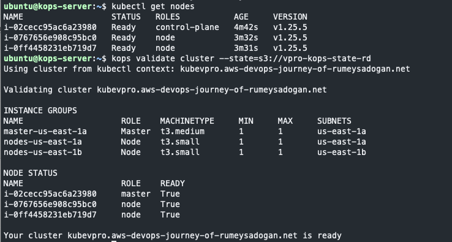

### Step-6: Git repo setup

We will create a GitHub repository with the name of `cicd-kube-docker`.
then we will clone it to our kops instance.
```sh
git clone https://github.com/rumeysakdogan/cicd-kube-docker.git
```

We will also clone the source code repository that we will be using a lot.
```sh
git clone https://github.com/devopshydclub/vprofile-project.git 
cd vprofile-project/
ls
git checkout vp-docker
ls
cp -r * ../cicd-kube-docker/
cd ..
cd cicd-kube-docker/
ls
```

We should see the copied files in our new repository directory. We will remove folders that are not needed.
```sh
rm -rf Docker-web/ Docker-db/ ansible/ compose/
mv Docker-app/Dockerfile .
rm -rf Docker-app/ helm/
ls
```

### Step-7: Helm charts setup

Go to `cicd-kube-docker` directory, we will create a directory called `helm` and run helm command to create our helm charts for vprofile project.

```sh
cd cicd-kube-docker
mkdir helm
cd helm
helm create vprofilecharts
```

Helm will create a sample K8s templates under `templates` dirctory. We will remove all of them, and copy our K8s manifests from `kubernetes/vprofileapp` directory from our repo.

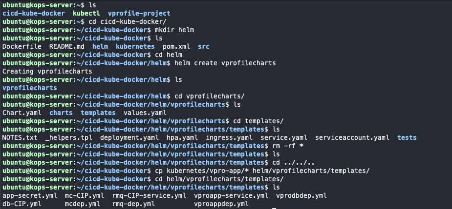

We will run the application from latest image as a result of each build. For this reason we need to have a variable for imageTag instead of hardcoded value in `vproappdep.yml` file .

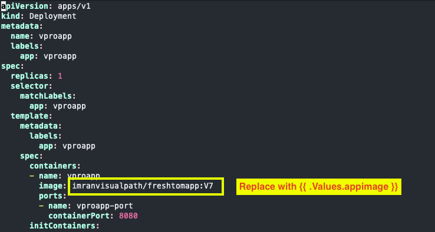

After making above change now, we are ready to test our helm charts.

Go to root directory of your repository and create a new kubernetes namespace.
```sh
kubectl create ns test
```


We can also list our first stack from helm with below command:
```sh
helm list --namespace test
```

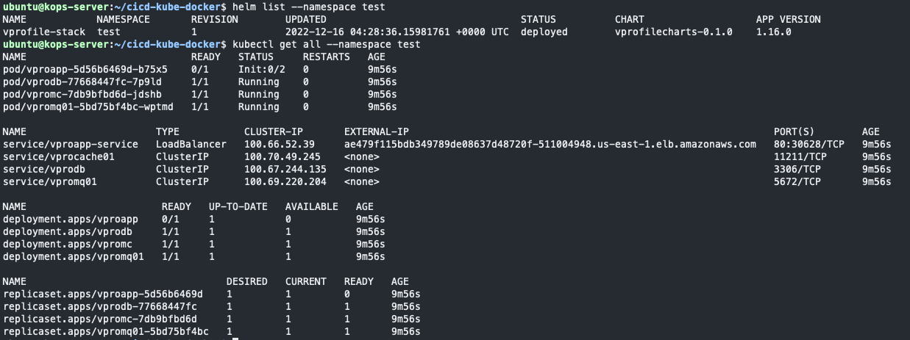

Now we can delete our stack with below command:
```sh
helm delete vprofile-stack --namespace test
```

We will create another namesapce which will be used in Jenkins:
```sh
kubectl create namespace prod
```

Now we will add all files we have created under `cicd-kube-docker` repo to remote repository:
```sh
git add .
git commit -m "adding helm charts"
git push
```

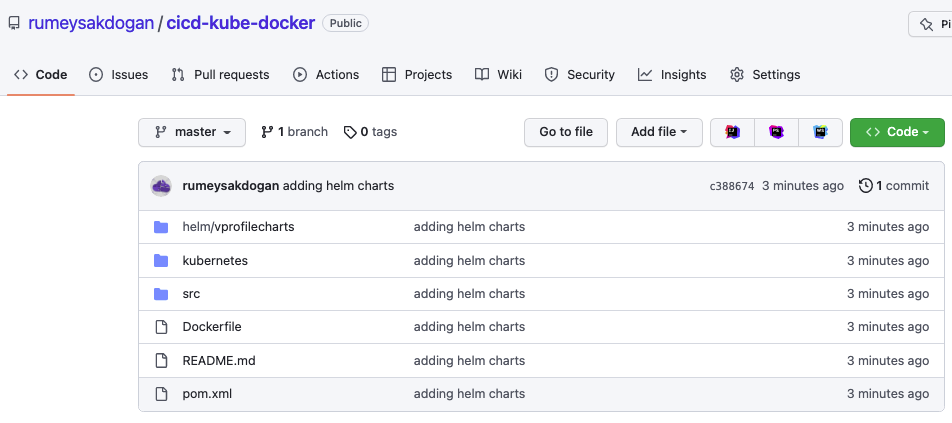

### Step-8: Writing pipeline Code

We will create a Jenkinsfile in our source code repository. Open your local `cicd-kube-docker` repo in one of IDE. I will be using IntelliJ.
Create `Jenkinsfile-rd` in the root directory.


In the deploy stage of Jenkinsfile, we will use helm commands from kops instance. For this, we need to add our Kops instance as Jenkins slave.
SSH into kops instance.

```sh
sudo apt update && sudo apt install openjdk-11-jdk -y
sudo mkdir /opt/jenkins-slave
sudo chown ubuntu.ubuntu /opt/jenkins-slave -R
java -version
```

We need to update `Kops-SG` to allow `Jenkins-SG` to access this instance on port 22.

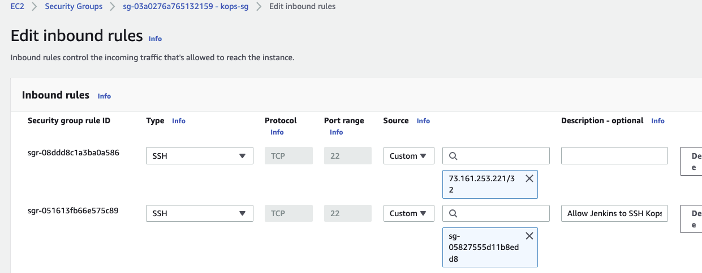

Then, we need to go to Jenkins server and add Kops instance as jenkins slave. `Manage Jenkins` -->  `Manage Nodes and Clouds` --> `new Node`
```sh
Name: kops
Type: Permanent Agent
Remote root directory: /opt/jenkins-slave
Labels: KOPS        # same will be used in Jenkinsfile
Usage: Only build jobs with label expresiions matching this node
Launch Method: Launch agents via SSH
Host: Private IP of KOPS EC2 instance
Credentials: Add new
    * Type: SSH username with private key
    * Username: ubuntu
    * Private Key: Paste kops-private key you have created before
    * ID: kops-login
    * Description: kops-login
Host Key Verification Strategy: Non verifying Verification strategy
```

Click `Launch Agent` to test the connection.

Once our `Jenkinsfile-rd` ready with all its contents, we will commit the changes to GitHub.

We have used SonarHome as `mysonarscanner4`in Jenkinsfile, we will go to Jenkins `Manage Jenkins` --> `Global Tool Configuration`. Find sonarQube and change name to `mysonarscanner4`. Then save it.

_If your pipeline fail in Quality Gate stage, create a new Quality gate in Sonar and add to your project. Make sure you create a Sonar webhook so that Sonarqube can communicate back with jenkins._

### Step-9: Execution

Create a new job in Jenkins with name of `kube-cicd` with type of Pipeline.
```sh
Pipeline Definition: Pipeline script from SCM
SCM: Git
Repository URL: https://github.com/rumeysakdogan/cicd-kube-docker.git
branch: */master
Script Path: Jenkinsfile-rd
```

We are ready to click `Build Now`.


We can check our kubernetes deployment from `Kops instance`. SSH into Kops instance.

```sh
helm list --namespace prod
kubectl get all
```

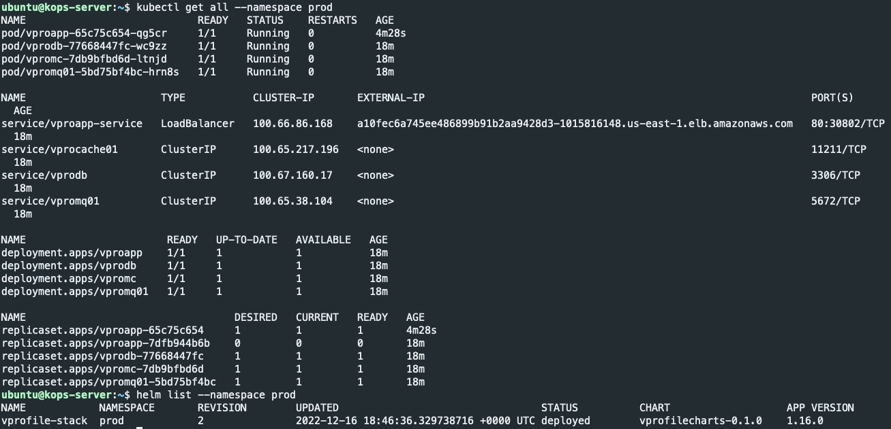

We can get the LoadBalancer url and check application from browser.

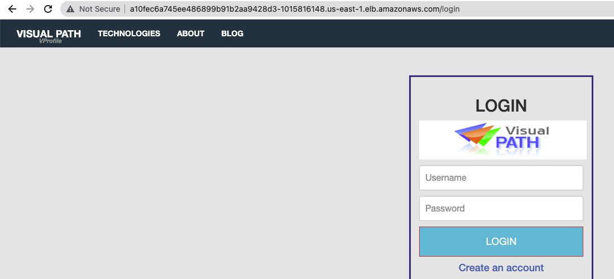


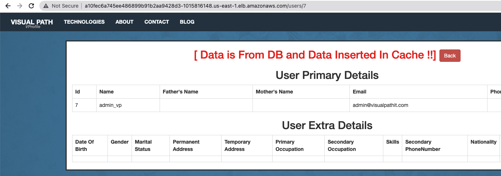


Lets check DockerHub repo for images:

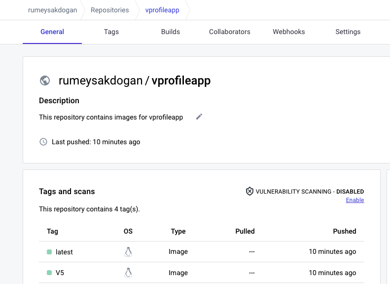

We also get slack notification as Success:


### Step-10: Clean-Up

We can delete our cluster with below command:
```sh
kops delete cluster --name kubevpro.aws-devops-journey-of-rumeysadogan.net --state=s3://vpro-kops-state-rd --yes
```

Then stop/terminate instances used during this project.
